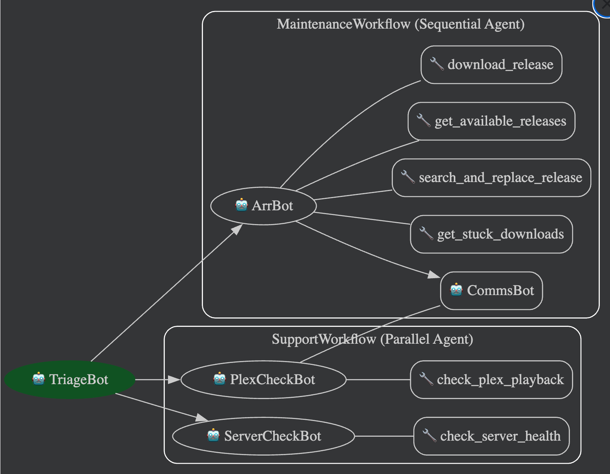

# Agent IA - Support Média (Plex & Arr Stack)

## 📌 Objectif du Projet

Ce projet utilise une architecture multi-agents (IA) pour diagnostiquer, gérer, et résoudre de manière autonome les problèmes liés à un serveur de streaming multimédia (Plex) et à sa chaîne de téléchargement automatisée (la fameuse "Arr Stack" : Sonarr, Radarr).
L'objectif est d'offrir une assistance technique automatisée : lorsqu'un utilisateur signale un problème (serveur lent, média manquant, fichier bloqué...), les agents enquêtent, trouvent la cause (requête bloquée, problème de transcodage, téléchargement planté), tentent de résoudre l'erreur (relancer un téléchargement, chercher une autre _release_) et informent l'utilisateur par message privé.

---

## 🏗️ Les outils impliqués (en dehors de ADK)

- **Plex** : Il s'agit du serveur multimédia personnel. Il organise les films et séries et permet de les diffuser (streamer) vers n'importe quel appareil (TV, Smartphone, PC).
- **Radarr** : Un gestionnaire de bibliothèques de films. Il surveille les indexeurs (trackers) pour trouver les films demandés de la meilleure qualité, et les envoie automatiquement aux clients de téléchargement (BitTorrent / Usenet).
- **Sonarr** : L'équivalent de Radarr, mais spécialisé pour le téléchargement et la gestion des Séries TV (gestion par saisons/épisodes).
- **Tautulli** : Un outil tiers de monitoring pour Plex. Il permet d'extraire des statistiques détaillées, notamment de savoir en temps réel qui regarde quoi, avec quelle qualité, et surtout s'il y a du _transcodage_ (souvent responsable de lenteurs) ou des problèmes de sous-titres.

---

## 🤖 Les Agents et Leurs Outils

L'architecture repose sur plusieurs agents ayant chacun un rôle très précis :

<!-- Image -->



### 1. **TriageBot**

- **Rôle** : Point d'entrée principal. Il analyse la demande de l'utilisateur et détermine s'il s'agit d'une demande de support (problème de lecture) ou d'une demande de maintenance (média manquant ou téléchargement bloqué). Il transmet ensuite la requête au bon workflow.

### 2. **ArrBot**

- **Rôle** : Gère tout ce qui concerne Radarr et Sonarr.
- **Outils utilisés** :
  - `get_stuck_downloads` : Permet de trouver les téléchargements coincés, en erreur ou manquants.
  - `get_available_releases` : Cherche sur les trackers les _releases_ disponibles pour un média.
  - `download_release` : Lance le téléchargement d'une _release_ spécifique.
  - `search_and_replace_release` : Lance la commande automatique de l'API pour chercher une meilleure source.

### 3. **PlexCheckBot / ServerCheckBot**

- **Rôle** : Dans le workflow de support, son objectif est de vérifier ce qui se passe sur Plex en temps réel. Si l'utilisateur se plaint que "ça lag", il vérifie.
- **Outils utilisés** :
  - `check_plex_playback` : Interroge Tautulli pour récupérer la session de l'utilisateur, vérifier si le flux est en _Direct Play_ ou s'il y a du _Transcodage_ forcé, détecter l'absence de sous-titres et analyser le bitrate/résolution.

### 4. **CommsBot** (L'Agent de Communication)

- **Rôle** : C'est la face visible de l'IA. Il récupère les rapports techniques bruts générés par les autres robots (par exemple: "Erreur 500 sur le serveur", ou "Release rempacée avec succès") et formule une réponse claire, polie et adaptée pour l'utilisateur.

---

## 🧠 Modèles d'Intelligence Artificielle Utilisés

Le projet tourne localement et utilise **Ollama** pour interroger les modèles d'IA sans dépendre de clés d'API externes coûteuses :

- `ollama/mistral` : Le modèle principal de l'application. Utilisé par la majorité des agents (TriageBot, ArrBot, CommsBot) pour ses très bonnes capacités de suivi d'instructions et d'utilisation d'outils (Tool Calling / Function Calling).

---

## 🚀 Installation & Lancement

### Pré-requis

1. Avoir **Python 3.10+** installé.
2. Avoir **Ollama** installé sur la machine hôte.
3. Télécharger les modèles nécessaires via le terminal :
   ```bash
   ollama pull mistral:latest
   ```
4. Avoir des instances fonctionnelles de Sonarr, Radarr et Tautulli/Plex.

### Installation

1. **Cloner le repository** et se placer dans le dossier.
2. **Créer et activer un environnement virtuel python** :

   ```bash
   python3 -m venv .venv
   source .venv/bin/activate  # Sous Mac/Linux
   # ou .venv\Scripts\activate sous Windows
   ```

3. **Installer les dépendances** :
   _(Assurez-vous d'avoir un fichier `requirements.txt` avec les librairies adéquates ou installez `sonarr-py`, `radarr-py`, `requests`...)_

   ```bash
   pip install -r requirements.txt
   ```

   ou

   ```bash
   uv sync
   ```

4. **Configurer les variables d'environnement** :
   Créez un fichier `.env` à la racine du projet, en vous basant sur cet exemple :

   ```env
   # API ARR STACK
   SONARR_URL=http://localhost:8989
   SONARR_API_KEY=votre_cle_api_sonarr
   RADARR_URL=http://localhost:7878
   RADARR_API_KEY=votre_cle_api_radarr

   # API TAUTULLI / PLEX
   TAUTULLI_URL=http://localhost:8181
   TAUTULLI_API_KEY=votre_cle_api_tautulli
   ```

5. **Lancement** :
   ```bash
   python main.py
   ```
   L'agent sera alors opérationnel et prêt à analyser les requêtes !

---

## 🛠️ Framework d'Agent Utilisé : Google ADK

Ce projet s'appuie sur le **Google Agent Development Kit (ADK)** pour définir et orchestrer le système multi-agents. L'ADK fournit la structure nécessaire pour :

- Définir des agents avec des rôles et des instructions spécifiques.
- Créer et associer des outils (Tools) que les agents peuvent invoquer de manière autonome.
- Gérer le cycle de vie de l'agent et intercepter les différentes phases grâce à un système de **callbacks** très modulable.

---

## ⚠️ Difficultés Rencontrées

Lors du développement avec des modèles locaux (Mistral / Llama via Ollama), plusieurs défis liés au comportement des agents ont été observés :

### 1. Mauvais Nom d'Outil Invoqué (Hallucination)

Les modèles peuvent parfois "halluciner" et tenter d'invoquer des outils qui n'existent pas (ex: `analyse_probleme`), ce qui provoquerait une erreur fatale.
_Solution mise en place :_

- Un système d'interception a été mis en place via les **callbacks** ADK (au niveau de `on_tool_start`).
- Si l'agent tente d'utiliser un outil qui ne figure pas dans la liste stricte `VALID_TOOLS`, le système intercepte l'appel.
- Le callback retourne dynamiquement à l'agent un message d'erreur clair (`Tool 'X' does not exist`) et une instruction stricte l'obligeant à choisir dans la liste des outils autorisés pour qu'il corrige son raisonnement.

### 2. Problème d'Exécution d'Outils en Boucle

Il a été constaté que l'agent pouvait parfois rester bloqué dans une boucle infinie, rappelant sans cesse le même outil en boucle avec les mêmes paramètres, incapable de clôturer son action.
_Solution mise en place :_ Optimisation des descriptions des outils et instructions plus strictes pour forcer l'agent à s'arrêter une fois l'information récupérée, et implémentation de garde-fous (soit via l'ADK, soit via le prompt) pour limiter les boucles de raisonnement non fructueuses.

### 3. Formulation de Réponse Initiale par le Mauvais Agent

Initialement, des agents de diagnostic technique comme `ArrBot` ou `TriageBot` formulaient eux-mêmes une réponse destinée à l'utilisateur final.
_Solution mise en place :_ Modification des `System Prompts` et des _States_ : ces agents de diagnostic ont maintenant l'interdiction stricte de parler directement à l'utilisateur. Ils doivent uniquement compiler leurs résultats techniques et les transmettre en interne. Seul le **CommsBot** a le droit de rédiger le message final clair et vulgarisé.

---

## 🌍 Comment Déployer (Production)

Pour déployer la solution afin qu'elle fonctionne de manière continue (au-delà du développement local) :

1. **Conteneurisation (Docker & Compose)** : Un répertoire `Dockerfile` et `docker-compose.yml` sont fournis à la racine. Le projet peut ainsi être lancé facilement avec `docker compose up -d` et rattaché à votre stack existante (Sonarr, Radarr).
2. **Service Système (Systemd)** : Sous Linux, configurer le script `main.py` sous forme de service daemon. Cela garantit le fonctionnement en arrière-plan, le démarrage automatique au boot et le redémarrage en cas de plantage.
3. **Configuration du Modèle** : Si vous hébergez Ollama sur un serveur séparé ou via Docker, assurez-vous de configurer correctement les variables d'environnement (`OLLAMA_HOST=http://...`) dans le `.env` ou le `docker-compose.yml` pour que l'agent s'y connecte.

---

## 🔮 Pistes d'Amélioration (Roadmap)

Voici quelques idées de fonctionnalités qui pourraient être améliorées ou ajoutées :

- **Implémentation d'un Bot Discord** : Remplacer l'interaction dans le terminal actuel par une intégration complète avec un bot Discord, permettant à chaque utilisateur de demander de l'aide directement depuis un serveur.
- **Filtrage par Tags des Outils** : Utilisation de tags pour filtrer les résultats des outils (tools) en fonction du nom de l'utilisateur ayant formulé la requête, permettant de personnaliser les requêtes et l'affichage des résultats en fonction de l'utilisateur (identifié via Discord).
- **Intégration d'outils supplémentaires** :
  - _Overseerr_ pour intégrer les demandes de gestion des requêtes des utilisateurs.
  - _Bazarr_ pour gérer, corriger et télécharger des sous-titres manquants via l'agent.
- **Rapports Proactifs** : Avoir un agent capable de générer des vérifications quotidiennes du serveur de lui-même sans attendre qu'un utilisateur vienne se plaindre d'une lenteur.
